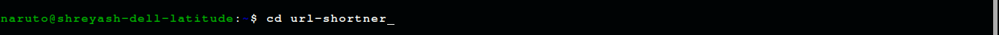
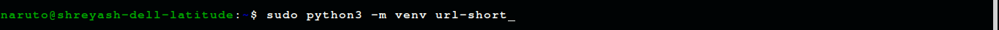

<h1 align='center'>Python Flask Mini project.</h1>
<h3>Stetup</h3>
<ul>
<li>First you need to donload and install python and pip </li>
<li>Then install env by usung pip.</li>
<li><h2>Step to create project</h2>
  <ol><li>First create folder for project.</li>
    <li>Open folder in Terminal </li>
    <li>Give permissions </li>
    <li></li>
    <li></li>
    <li></li>
  </ol>
 </li>
</ul>
